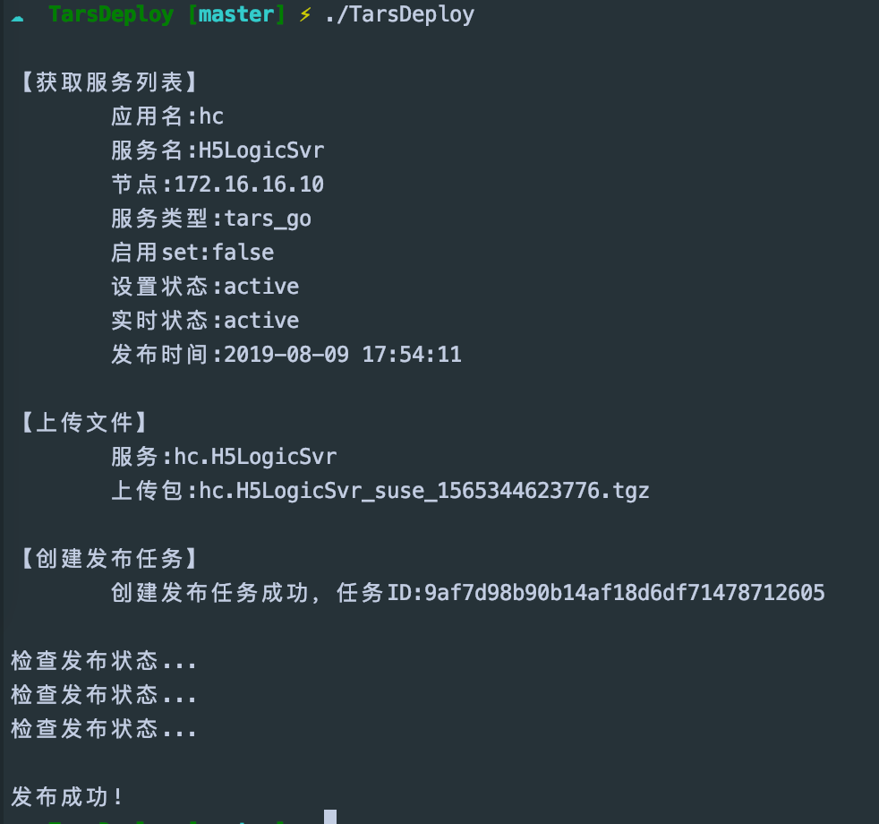

### tars自动发布工具

#### 使用方式
在可执行文件同目录下填写配置文件config.json，例如

```json
{
  "baseUrl": "xxx", // tars管理平台地址
  "app": "hc", // 应用名
  "server": "H5LogicSvr", // 服务名
  "comment": "", // 发布评论
  "filename": "/xxx/H5LogicSvr.tgz" // tgz文件路径
}
```

#### 发布效果

